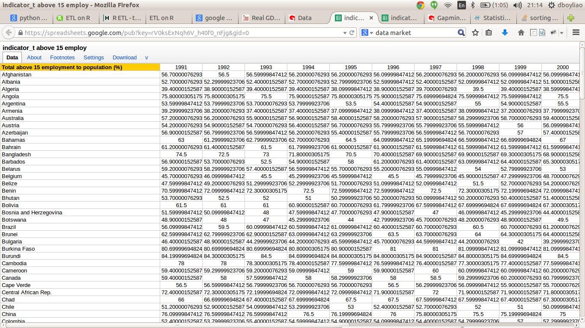
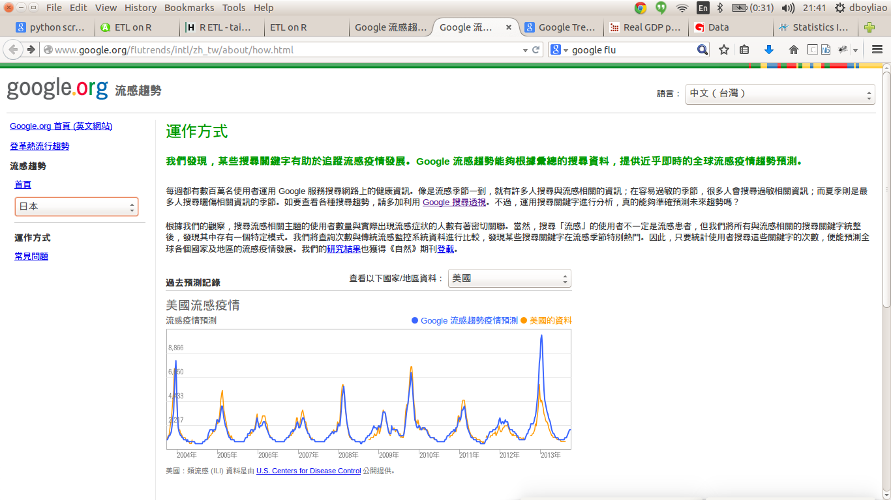
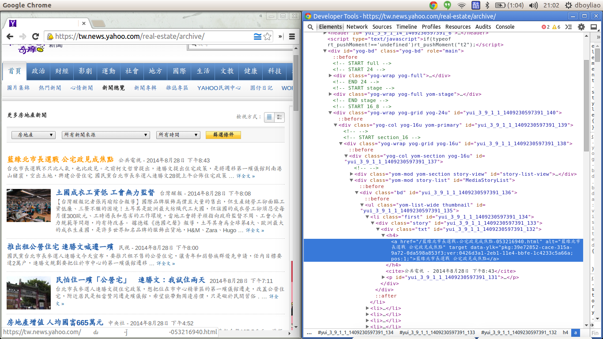
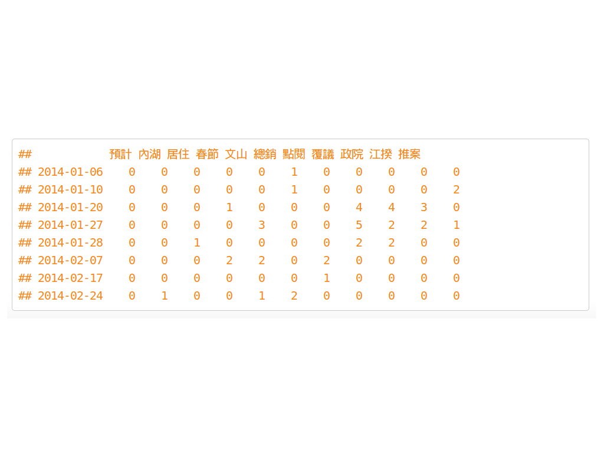
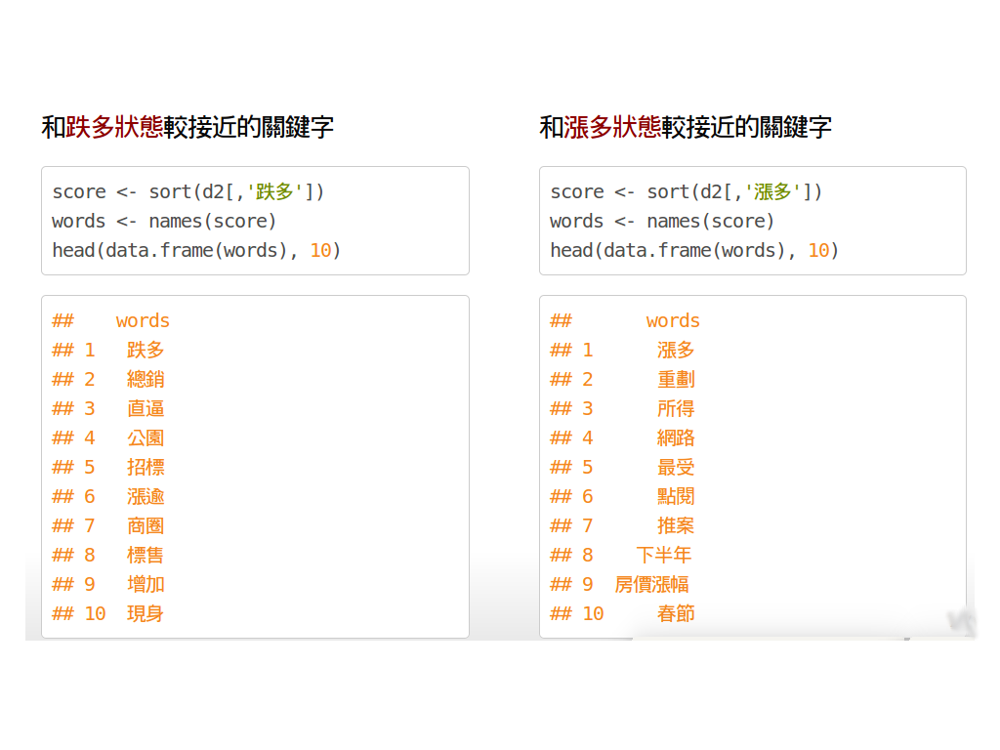
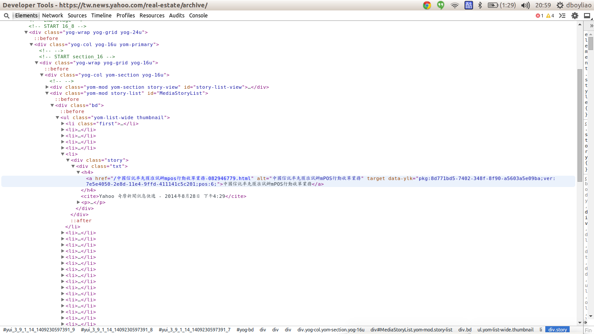
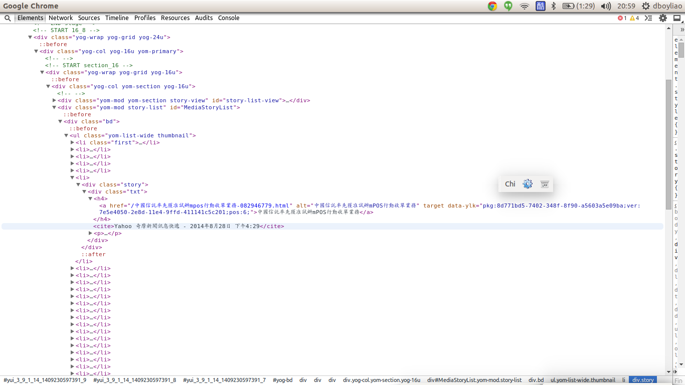

<q> 什麼是非結構化資料？ </q>


---

## 結構化資料

</img>


---

## 半結構化資料

</img>

---

## 非結構化資料

</img>

--- &vcenter

<q> 非結構化資料可以整理出什麼訊息呢？ </q>

---

</img>

---

</img>


---

<q> 我們這場 tutorial 要帶給大家什麼呢 ? </q>

---

## web scraping

</img>

--- &vcenter

</img>

--- &vcenter

</img>


---

## CH1 抓取網路資料

---

## What is HTML? 

### 一種有結構的標記資料

</img>

---

</img>


--- &vcenter

<q> 其實它們是有結構的 </q>

---

## Document Object Model (DOM)

### html 呈現樹狀結構

</img>

---

## 樹狀結構的內容

1. nodename
2. attribute
3. text

```r
<a href = "www.meetup.com/Taiwan-R">
  Taiwan R User Group Website
</a>
```

```r
nodename : a
attribute : href with value "www.meetup.com/Taiwan-R"
text: "Taiwan R User Group Website"
```

---
## xpath 常用到的操作

- / finds the root node

- // selects from anywhere in the tree

- '.' selects current node

- '..' selects parent of current node

- @ selects attributes

---
## 如果想抓 a 的話

### we can use:

```r
"/../body/div/a" or "//a"
```

</img>

---
## 如果指定 a 的 attribute 或 text
```r
If we had '<a href = "www.meetup.com/Taiwan-R">Taiwan R User Group Website</a>'
```
抓出 href = ’www.meetup.com/Taiwan-R’ 的 a
```r
"//a[@href = ’www.meetup.com/Taiwan-R’]"
```
抓出 text = ’Taiwan R User Group Website’ 的 a
```r
"//a[text() = ’Taiwan R User Group Website’]"
```
```r
nodename : a
attribute : href with value "www.meetup.com/Taiwan-R"
text: "Taiwan R User Group Website"
```

---

## 匯入套件


```r
require(DSC2014Tutorial)
require(XML)
require(stringr)
require(xts)
require(reshape2)
```

--- 
## 開啟下載好的 html 檔案

### [資料來源 - yahoo 新聞](https://tw.news.yahoo.com/real-estate/archive/1.html)


```r
# 讀取 ETL 相關檔案所在的路徑
path <- ETL_file('')
docs <- grep("*.html",dir(path), value = TRUE)
```


```r
pages <- sapply(docs, function(d){  
  path <- ETL_file(d)
  f <- file(path, encoding = 'UTF-8')
  f_size <- file.info(ETL_file(d))$size
  content <- readChar(f, f_size)
  close(f)
  return(content)
})
```


---
## 抓出 title和 連結


```r
library(XML)
# 建立 DOM Tree
doc <- htmlTreeParse(pages[1], useInternalNodes = TRUE)
# 抓出 node a 的 attr
attr <- xpathApply(doc, "//ul/li/div/div/h4/a", xmlAttrs)
# 抓出 node a 的 text
text <- xpathSApply(doc, "//ul/li/div/div/h4/a", xmlValue)
```

### text 結果

```
## [1] "稅制改革座談 財長明督軍"                      
## [2] "缺地… 租稅引導產業南移"                       
## [3] "房地合一 建商：重稅擾民"                      
## [4] "租不起 「天天見麵」悄收台北店"                
## [5] "《世紀專欄》地價稅納稅義務基準日為每年8月31日"
## [6] "苗房屋標準單價公告調整 7月起實施"
```

---
</img>


---
## 一次抓多篇


```r
# lapply : 最後將回傳 list 型態的結果
title <- lapply(pages, function(p){
  doc <- htmlTreeParse(p, useInternalNodes = TRUE)
  xpathSApply(doc, "//ul/li/div/div/h4/a", xmlValue)
})
```

```
## [[1]]
## [1] "稅制改革座談 財長明督軍" "缺地… 租稅引導產業南移" 
## 
## [[2]]
## [1] "抗議一地兩價 遷建戶下跪向費鴻泰陳情"
## [2] "房產觀望氣氛 中市推案減兩成"        
## 
## [[3]]
## [1] "綠大地五股市區 千坪綠地" "在地專家"
```

--- 

## 練習題1
### 請填入適當的 xpath 抓出新聞來源, 日期, 時間

```r
src_list <- xpathSApply(doc, ___ , xmlValue)
```

---
</img>

---
## 解答1

```r
src_list <- xpathSApply(doc, "//cite", xmlValue)

```


---

## (自行操作) 保存/讀取 抓下來的數據

### 先將結果合併為表格
```r
doc <- do.call(rbind, title)
```

### 寫入 / 讀回 數據
```r
writeLines(doc, "news_yahoo.txt")
news_yahoo <- readLines('news_yahoo.txt')
```

---

## 匯入這次用的資料

### [資料來源 - 鉅亨網](http://house.cnyes.com/News/tw_housenews/List.htm)


```r
path <- ETL_file('news.txt')
f <- file(path, encoding="UTF-8")
house_news <- readLines(f) 
head(house_news)
```

```
## [1] "2014-06-24富邦人壽信義區再插旗 A25案172億元奪標"                          
## [2] "2014-06-24北市A25地上權案 富邦權利金172.88億元得標"                       
## [3] "2014-06-23房市管制 央行將化明為暗"                                        
## [4] "2014-06-20史上頭一遭!大直新地王 1坪212萬＃超越信義之星直逼帝寶 中山新天價"
## [5] "2014-06-20大直帝景水花園實價首破200萬 北市3大豪宅板塊確立"                
## [6] "2014-06-19樺福千金捷運宅標脫率89.4% 均價63萬元屬合理範圍"
```


---

## CH2 字串處理

---
## 正規表達 介紹

```r
\\d -> 數字 
\\w -> 單字 
.   -> 任意字元(數字, 單字, 標點符號 ..) 

?   -> 出現 0或1 次 
+   -> 出現 1次 以上 
*   -> 出現 0次 以上 

^   -> 出現在行首
$   -> 出現在行尾

```

---


```r
x <- c("apples*14", "flour", "sugar*100", "milk*3")
```

### 批配2個數字

```r
str_extract(x, "\\d{2}")
```

```
## [1] "14" NA   "10" NA
```

### 批配2~3個數字

```r
str_extract(x, "\\d{2,3}")
```

```
## [1] "14"  NA    "100" NA
```

---

```r
x <- c("apples*14", "flour", "sugar*100", "milk*3")
```

### 批配出現一次以上的a或p

```r
str_extract(x, "[ap]+")
```

```
## [1] "app" NA    "a"   NA
```

### 也可以搭配{m,n}

```r
str_extract(x, "[ap]{1,4}")
```

```
## [1] "app" NA    "a"   NA
```

---
## 練習題2
### 猜猜看這會批配出什麼東西？

```r
x <- c("apples*14", "flour", "allen", "aside")

str_extract(x, "a[elpn]+.?")
```

---
## 解答2

```r
x <- c("apples*14", "flour", "allen", "aside")

str_extract(x, "a[elpn]+.?")
```

```
## [1] "apples" NA       "allen"  NA
```


---
## 進階一點的正規表達

### 抽取 log訊息時很有用的 () 批配
### 可以把 match 的字儲存倒 \\{n}


```r
x <-"2014-06-24富邦人壽信義區再插旗 A25案172億元奪標"
patten <- "(\\d{4}-\\d{2}-\\d{2}).+(信義.?).+"

gsub(patten, "\\1, \\2", x)
```

```
## [1] "2014-06-24, 信義區"
```

---

## 練習題3

請利用下面提示，填入適當的 Patten，產生出下面結果

```r
# 請利用 \\d{?}-\\d{?}-\\d{?} 抽取出時間 
dates <- str_extract(house_news, ___)

# 請利用 \\d{?}-\\d{?}-\\d{?} 把時間取代為 ''
titles <- str_replace(house_news, ___, ___)

house_news <- cbind(dates, titles)
```


```
##      dates        titles                                    
## [1,] "2014-06-24" "富邦人壽信義區再插旗 A25案172億元奪標"   
## [2,] "2014-06-24" "北市A25地上權案 富邦權利金172.88億元得標"
## [3,] "2014-06-23" "房市管制 央行將化明為暗"
```

---
## 解答3
```r
dates <- str_extract(house_news, "\\d{4}-\\d{2}-\\d{2}")
titles <- str_replace(house_news, "\\d{4}-\\d{2}-\\d{2}", "")

house_news <- cbind(dates, titles)
```


---

## 清除符號的方法介紹

### [[:punct:]] 表示標點符號
### [[:blank:]] 表示分隔符號


```r
str_replace_all("i l<ik>e ?R pr:ogr,a%mi!ng", "[[:punct:]]", "")
```

```
## [1] "i like R programing"
```

```r
str_replace_all("a \t p \t p ", "[[:blank:]]", "")
```

```
## [1] "app"
```

---

## 如果想清除中文特殊符號 ...

### 這是 utf-8 編碼


```r
punctuation <- "\u3002 \uff1b \uff0c \uff1a \u201c \u201d \uff08 \uff09 \u3001 \uff1f \u300a \u300b"

punctuation
```

```
## [1] "。 ； ， ： “ ” （ ） 、 ？ 《 》"
```


```r
str_replace_all("。 ； ， ： “ ” （ ） 、 ？ 《 》", punctuation, "")
```

```
## [1] ""
```

--- &vcenter

<q> 再來要介紹一個非常重要的 function </q>


---

## substr 用法


```r
substr('富邦人壽信義區再插旗 A25案172億元奪標', 1, 4)
```

```
## [1] "富邦人壽"
```

```r
substr('富邦人壽信義區再插旗 A25案172億元奪標', 5, 7)
```

```
## [1] "信義區"
```

--- &vcenter

<q>看來很簡單,那為什麼說它很重要呢？</q>


--- &vcenter

<q> 做個練習可能就有感覺了 </q>


---

## 練習題4

### 空格填 i or i+1，才呈現出下面使用範例？
```r
ngram <- function(sentence, n){
  chunk <- c()
  for(i in 1 : (nchar(sentence)-n+1)){
    chunk <- append(chunk, substr(sentence, ___ , i+n-1))
  }
  return(chunk)
}
```


### 使用範例

```r
ngram('富邦人壽信義區再插旗', 2)
```

```
## [1] "富邦" "邦人" "人壽" "壽信" "信義" "義區" "區再" "再插" "插旗"
```


---
## 解答4
```r
ngram <- function(sentence, n){
  chunk <- c()
  for(i in 1 : (nchar(sentence)-n+1)){
    chunk <- append(chunk, substr(sentence, i, i+n-1))
  }
  return(chunk)
}
```

---


```r
sapply(titles, ngram, 2, USE.NAMES = FALSE)[1:3]
```

```
## [[1]]
##  [1] "富邦" "邦人" "人壽" "壽信" "信義" "義區" "區再" "再插" "插旗" "旗 " 
## [11] " A"   "A2"   "25"   "5案"  "案1"  "17"   "72"   "2億"  "億元" "元奪"
## [21] "奪標"
## 
## [[2]]
##  [1] "北市" "市A"  "A2"   "25"   "5地"  "地上" "上權" "權案" "案 "  " 富" 
## [11] "富邦" "邦權" "權利" "利金" "金1"  "17"   "72"   "2."   ".8"   "88"  
## [21] "8億"  "億元" "元得" "得標"
## 
## [[3]]
##  [1] "房市" "市管" "管制" "制 "  " 央"  "央行" "行將" "將化" "化明" "明為"
## [11] "為暗"
```

---


```r
sapply(titles, ngram, 3, USE.NAMES = FALSE)[1:3]
```

```
## [[1]]
##  [1] "富邦人" "邦人壽" "人壽信" "壽信義" "信義區" "義區再" "區再插"
##  [8] "再插旗" "插旗 "  "旗 A"   " A2"    "A25"    "25案"   "5案1"  
## [15] "案17"   "172"    "72億"   "2億元"  "億元奪" "元奪標"
## 
## [[2]]
##  [1] "北市A"  "市A2"   "A25"    "25地"   "5地上"  "地上權" "上權案"
##  [8] "權案 "  "案 富"  " 富邦"  "富邦權" "邦權利" "權利金" "利金1" 
## [15] "金17"   "172"    "72."    "2.8"    ".88"    "88億"   "8億元" 
## [22] "億元得" "元得標"
## 
## [[3]]
##  [1] "房市管" "市管制" "管制 "  "制 央"  " 央行"  "央行將" "行將化"
##  [8] "將化明" "化明為" "明為暗"
```


--- &vcenter

<q> 透過substr才能從文章裡抽出詞彙呀！ </q>


---

## 把字段長度1~6都列舉出來，並分別儲存


```r
titles <- gsub("\\s", "", titles)
piece <- list()

piece[['1']] <- unlist(sapply(titles, ngram, 1, USE.NAMES = FALSE))
piece[['2']] <- unlist(sapply(titles, ngram, 2, USE.NAMES = FALSE))
piece[['3']] <- unlist(sapply(titles, ngram, 3, USE.NAMES = FALSE))
piece[['4']] <- unlist(sapply(titles, ngram, 4, USE.NAMES = FALSE))
piece[['5']] <- unlist(sapply(titles, ngram, 5, USE.NAMES = FALSE))
piece[['6']] <- unlist(sapply(titles, ngram, 6, USE.NAMES = FALSE))
```


--- &vcenter

<q> 但是有個問題 ！ </q>

---


```r
sapply(titles, ngram, 3, USE.NAMES = FALSE)[1:3]
```

```
## [[1]]
##  [1] "富邦人" "邦人壽" "人壽信" "壽信義" "信義區" "義區再" "區再插"
##  [8] "再插旗" "插旗A"  "旗A2"   "A25"    "25案"   "5案1"   "案17"  
## [15] "172"    "72億"   "2億元"  "億元奪" "元奪標"
## 
## [[2]]
##  [1] "北市A"  "市A2"   "A25"    "25地"   "5地上"  "地上權" "上權案"
##  [8] "權案富" "案富邦" "富邦權" "邦權利" "權利金" "利金1"  "金17"  
## [15] "172"    "72."    "2.8"    ".88"    "88億"   "8億元"  "億元得"
## [22] "元得標"
## 
## [[3]]
## [1] "房市管" "市管制" "管制央" "制央行" "央行將" "行將化" "將化明" "化明為"
## [9] "明為暗"
```

--- &vcenter

<q>注意到了嗎？</q>
<q>裡面有很多沒意義的字串</q>


--- &vcenter

<q>如何解決呢？</q>


--- &vcenter

<q> '房價偏' 是不是一個有意義的詞彙呢？ </q>


--- &vcenter

<q> '房價' + '偏' 是否機率獨立？</q>

<q> '房' + '價偏' 是否機率獨立？</q>


--- &vcenter

<q> 服貿協議 </q>

<q> '服貿協' 右邊幾乎只能接 '議'</q>

<q> '貿協議' 左邊幾乎只能接 '服'</q>


--- &vcenter

<q> 利用這兩種性質來篩選掉沒意義的字串 </q>


--- &vcenter

<q> 但是程式該怎麼寫呢？ </q>


--- &vcenter

<q> 繼續用 substr ! </q>

<q> 然後加上一點簡單的正規表達 </q>

---

## 練習題5
### 空格填 i or i+1，才能呈現出下一頁的使用範例？

```r
segmentWord <- function(word){
  # nchar 算字串長度
  n <- nchar(word)-1
  seg <- lapply(1: n, function(i){
    w1 <- substr(word, 1, i)
    w2 <- substr(word, ___ , n+1)
    c(w1,w2)
  })
  return(seg)
}
```

---


```r
segmentWord('富邦銀')
```

```
## [[1]]
## [1] "富"   "邦銀"
## 
## [[2]]
## [1] "富邦" "銀"
```

```r
segmentWord('大同區全')
```

```
## [[1]]
## [1] "大"     "同區全"
## 
## [[2]]
## [1] "大同" "區全"
## 
## [[3]]
## [1] "大同區" "全"
```


---
## 解答5

```r
segmentWord <- function(word){
  n <- nchar(word)-1
  seg <- lapply(1: n, function(i){
    w1 <- substr(word, 1, i)
    w2 <- substr(word,i+1, n+1)
    c(w1,w2)
  })
  return(seg)
}
```

--- &vcenter

<q>已經會把字串兩個兩個拆開</q>
<q>但是機率從哪來 ? </q>

---
## 操作
### 算 字段 出現次數


```r
words_freq <- table(unlist(piece))
```

```
## 
## 信義區   北市   房價   房市   上漲 
##      8     81     38     33      2
```

---

## 操作
### 算出機率


```r
N <- sum(words_freq[piece[['1']]])
words_prob <- words_freq / N
```

```
## 
##         龍江       龍江路     龍江路土   龍江路土地 龍江路土地由 
##    4.155e-06    4.155e-06    4.155e-06    4.155e-06    4.155e-06
```


--- &vcenter

<q> 以下這種性質要怎麼寫出程式呢？ </q>

<q> '服貿協' 右邊幾乎只能接 '議'</q>

<q> '貿協議' 左邊幾乎只能接 '服'</q>


---
## paste, grep 用法


```r
paste("富邦" ,"人壽", sep='')
```

```
## [1] "富邦人壽"
```

```r
grep('富邦' , c('富邦金', '法人富邦', '台北富邦銀行'))
```

```
## [1] 1 2 3
```

```r
grep('^富邦' , c('富邦金', '法人富邦', '台北富邦銀行'))
```

```
## [1] 1
```

```r
grep('富邦$' , c('富邦金', '法人富邦', '台北富邦銀行'))
```

```
## [1] 2
```

---

## 練習題6
### 請找出 '義區' 開頭/結尾 的字串
### 可以參考上一頁

```r
word <- '義區'

# 找出比 '義區' 字串長度 多1 的所有字串
BASE <- piece[[as.character(nchar(word)+1)]]

# 找出 '義區' 開頭的字串
PATTEN1 <- paste( __ , '義區', sep = '')
matchs1 <- grep(PATTEN1 , BASE, value = TRUE)
  
# 找出 '義區' 結尾的字串
PATTEN2 <- paste('義區' , __ , sep = '')
matchs2 <- grep(PATTEN2 , BASE, value = TRUE)

```


---
## 解答6


```r
word <- '義區'

# 找出比 '義區' 字串長度 多1 的所有字串
BASE <- piece[[as.character(nchar(word)+1)]]

# 找出 '義區' 開頭的字串
PATTEN1 <- paste('^', '義區', sep = '')
matchs1 <- grep(PATTEN1 ,BASE , value = TRUE)

# 找出 '義區' 結尾的字串
PATTEN2 <- paste('義區' ,'$', sep = '' )
matchs2 <- grep(PATTEN2 ,BASE , value = TRUE)
```

```
## [1] "義區再" "義區「" "義區豪" "義區螺" "義區最" "義區大" "義區竹" "義區豪"
```

```
## [1] "信義區" "信義區" "信義區" "信義區" "信義區" "信義區" "信義區" "信義區"
```

---

## 挑出單字長度 2~5 的 候選詞彙


```r
words_2_5 <- unique(unlist(piece[2:5]))
```


```
##  [1] "G「創新卓"  "仍可"       "0萬！小坪"  "應加以限制" "中小坪數"  
##  [6] "房市軟著"   "總銷破"     "一堆保留戶" "北市房仲網" "微幅漲0"   
## [11] "中後"       "是1、"      "夯淡水、"   "實現"       "6月"
```


--- &vcenter

## 長度2~5的 單字 出現次數分佈

 


---

## 找出 words_2_5 出現次數>2 的詞彙


```r
words <- names(which(words_freq[words_2_5] > 2))
```


```
## 
##     逾3.5% 捷運松山線 上半年完成 半年完成募 年完成募集      14-03 
##          3          3          3          3          3          3 
##      4-03-      14-02      4-02- 地政士法覆 政士法覆議 ：豪宅交易 
##          3          3          3          7          7          3 
##      14-01      4-01-   25日前提 
##          3          3          3
```


---
## CH3 進行聚合

---

## 前面 segmentWord 練習題的使用
### ex. 算'子字串'之間是否獨立


```r
cohesion <- function(word){
  
  # 先把 word切成兩個子字串
  seg <- segmentWord(word)
  
  val <- sapply(seg, function(x){    
    f_word <- words_freq[word]
    
    # 兩塊子字串的出現次數
    f_x1 <- words_freq[x[1]]
    f_x2 <- words_freq[x[2]]
    
    # 兩塊子字串是否獨立
    mi <- log2(N) + log2(f_word) - log2(f_x1) - log2(f_x2)
    return(mi)
  }) 
  return (min(val))
}
```

---
## 進行計算


```r
cohesion_val <- sapply(words, cohesion, USE.NAMES = FALSE)
names(cohesion_val) <- words

# 挑大於10的原因請看一下一頁
coh_words <- names(which(cohesion_val > 10))
```

```
##   賃需求     青睞   邦人壽   完成募 完成募集     揭露     募集     共識 
##    15.55    15.88    15.88    15.88    15.88    15.88    15.88    16.29 
##     汐止     影響 
##    16.29    16.29
```

---

 

---
### 計算單字左右兩邊可以串接其他單字的程度


```r
disorder <- function(word){  
  # 其實只是練習6的內容，加上算亂度
  BASE <- piece[[as.character(nchar(word)+1)]]
  
  PATTEN1 <- paste("^", word, sep = '')
  matchs1 <- grep(PATTEN1, BASE, value = TRUE)
  freq1 <- table(matchs1)  
  pre <- mean(-log2(freq1/sum(freq1)))
  
  PATTEN2 <- paste(word, "$", sep = '')
  matchs2 <- grep(PATTEN2, BASE, value = TRUE)
  freq2 <- table(matchs2)  
  post <- mean(-log2(freq2/sum(freq2)))
  
  index <- is.na(c(pre, post))
  condition <- any(index)
  return(ifelse(condition, c(pre, post)[!index], min(pre, post)))  
}
```

---
## 進行計算


```r
disorder_val <- sapply(coh_words, disorder, USE.NAMES = FALSE)
names(disorder_val) <- coh_words
```


```
##     土地       -0     捷運     信義 實價登錄     去年     雙北     實價 
##    3.000    3.188    3.233    3.238    3.295    3.298    3.379    3.394 
##     億元     交易     住宅     店面     豪宅     每坪     北市 
##    3.400    3.434    3.788    4.059    4.232    4.302    5.160
```

--- &vcenter
## 單字兩側的混亂程度分佈

 

---
## 挑出混亂程度 >1 的字串


```r
dis_words <- names(which(disorder_val > 1))
```

```
##  [1] "合宜住宅"   "店面租賃"   "張盛和："   "房市量縮"   "北市2月"   
##  [6] "住宅價格"   "房價年漲"   "房價漲幅"   "豪宅交易"   "實價登錄"  
## [11] "中山區最"   "店面交易"   "180萬"      "商用大樓"   "價潛力區"  
## [16] "地政士法"   "月實價登錄" "信義計畫區" "：豪宅交易" "25日前提"
```

---
## 混亂程度的例子

### 兩側混亂程度高的字

```
##  [1] "土地"     "-0"       "捷運"     "信義"     "實價登錄" "去年"    
##  [7] "雙北"     "實價"     "億元"     "交易"     "住宅"     "店面"    
## [13] "豪宅"     "每坪"     "北市"
```

### 兩側混亂程度低的字

```
##  [1] "富邦" "邦人" "人壽" "義區" "地上" "上權" "權案" "權利" "利金" "義之"
## [11] "之星" "下半" "樂觀" "新隆" "隆國"
```


--- &vcenter 

<q> 到這邊真是辛苦大家了 ... </q>
<q> 我們總算挑出有意義的字串了 歐耶！ </q>

--- &vcenter 

<q> 接下來我們算出關鍵字的出現次數 </q>

<q> 然後把各個出現次數合併起來就好了 </q>


--- &vcenter 
<q>這步驟 用 R 做起來真的是很輕鬆愉快 </q>
<q> 讓我們介紹一個很強大的 function </q>


---
## str_count 用法
### 算 a, e 出現次數


```r
fruit <- c("apple", "banana", "pear", "pineapple")

lapply(c("a", "e"), function(x){
  str_count(fruit, x)
})
```

```
## [[1]]
## [1] 1 3 1 1
## 
## [[2]]
## [1] 1 0 1 2
```

---
## 練習題7
### dis_words 裡面每個單字在新聞 title 的出現次數是多少？
### 請填入 dis_words 和 title

```r
tmp <- lapply( __ , function(word){ 
  # 算出 word 在title的出現次數
  str_count( __ , word)
})
# 把算出來結果，用 column combind 成一張表格
words_tbl <- do.call(cbind, tmp)
colnames(words_tbl) <- dis_words
```


```
##      每坪衝 商用大樓 4-0 增近 春節 增加 破千億 創新
## [1,]      0        0   0    0    0    0      0    0
## [2,]      0        0   0    0    0    0      0    0
## [3,]      0        0   0    0    0    0      0    0
## [4,]      0        0   0    0    0    0      0    0
```


---
## 解答7

```r
# 把 dis_words裡面的字一個一個送進去做運算
tmp <- lapply(dis_words, function(word){
  # 算出 word 在title的出現次數
  str_count(titles, word)
})

# 把算出來結果，用 column combind 成一張表格
words_tbl <- do.call(cbind, tmp)
colnames(words_tbl) <- dis_words
words_tbl[1:6, sample(ncol(words_tbl), 8)]
```

--- &vcenter

<q> 我們今天的課程就到這邊 </q>

<q> 希望大家已經學到以下幾件事情 </q>

--- &vcenter

<q> xpath + web scraping 的概念 </q>

<q> 利用正規表達來抽出需要的資訊 </q>

<q> 瞭解兩種方法來取出有意義的字串 </q>

<q> 計算字串的出現次數，與整理成出現次數表格 </q>


--- &vcenter

<q> 後面的投影片可以回家自行服用</q>
<q> 不用客氣 </q>


---
## xts 用法

```r
x <- matrix(1:10, 2,2)
y <- Sys.Date() + 1:2

xts(x,y)
```

```
##      [,1] [,2]
## [1,]    1    3
## [2,]    2    4
```

```
## [1] "2014-08-30" "2014-08-31"
```

```
##            [,1] [,2]
## 2014-08-30    1    3
## 2014-08-31    2    4
```

---
## 練習題8
### 請將 words_tbl 轉換成 xts 格式
### 提示：就是要轉 words_tbl ！！ 

```r
words_tbl_xts <- xts( ___ , as.POSIXct(dates))
```


```
##            信義 億元 北市 直逼 中山 實價 豪宅 捷運
## 2014-01-02    0    0    0    0    0    0    0    0
## 2014-01-02    0    0    1    0    0    0    0    0
## 2014-01-02    0    0    0    0    0    0    0    0
## 2014-01-02    0    0    1    0    0    0    0    0
## 2014-01-03    0    0    0    0    0    0    0    0
## 2014-01-03    0    0    1    0    0    0    0    0
```

---
## 解答8

```r
words_tbl_xts <- xts(words_tbl, as.POSIXct(dates))
```


---
## 轉成 xts 格式的好處

### 可以選取時間


```r
words_tbl_xts["2014-01-18/2014-01-20", 100:110]
```

```
##            預計 內湖 居住 春節 文山 總銷 點閱 覆議 政院 江揆 推案
## 2014-01-19    0    0    0    0    0    0    0    0    0    0    0
## 2014-01-20    0    0    0    0    0    0    0    1    1    0    0
## 2014-01-20    0    0    0    0    0    0    0    0    0    1    0
## 2014-01-20    0    0    0    0    0    0    0    1    1    1    0
## 2014-01-20    0    0    0    0    0    0    0    1    1    1    0
## 2014-01-20    0    0    0    0    0    0    0    0    0    0    0
## 2014-01-20    0    0    0    0    0    0    0    1    1    0    0
```

--- 
## 轉成 xts 格式的好處
### 可以對時間區間做運算, 例如 將 1~2月 每個禮拜的出現次數做加總

```r
ep.weeks <- endpoints(words_tbl_xts, "weeks", k=1)
count.weeks <- period.apply(words_tbl_xts, ep.weeks, FUN=colSums)
count.weeks["2014-01/2014-02", 100:110]
```

```
##            預計 內湖 居住 春節 文山 總銷 點閱 覆議 政院 江揆 推案
## 2014-01-06    0    0    0    0    0    1    0    0    0    0    0
## 2014-01-10    0    0    0    0    0    1    0    0    0    0    2
## 2014-01-20    0    0    0    1    0    0    0    4    4    3    0
## 2014-01-27    0    0    0    0    3    0    0    5    2    2    1
## 2014-01-28    0    0    1    0    0    0    0    2    2    0    0
## 2014-02-07    0    0    0    2    2    0    2    0    0    0    0
## 2014-02-17    0    0    0    0    0    0    1    0    0    0    0
## 2014-02-24    0    1    0    0    1    2    0    0    0    0    0
```

---
## 練習題9
### 請計算每個單字在 1~5 月的 每個月出現次數
### 填入 weeks or months ?
### 填入 2014-?/2014-?


```r
ep.month <- endpoints(words_tbl_xts, ___ , k=1)
count.month <- period.apply(words_tbl_xts, __ , FUN=colSums)
count.months[ ___ , 100:110]
```


```
##            預計 內湖 居住 春節 文山 總銷 點閱 覆議 政院 江揆 推案
## 2014-01-28    0    0    1    1    3    2    0   11    8    5    3
## 2014-02-27    0    3    0    3    3    2    3    0    0    0    0
## 2014-03-31    3    1    3    0    0    0    0    0    0    0    0
## 2014-04-30    0    0    0    0    0    0    0    0    0    0    0
## 2014-05-30    0    0    0    0    0    0    0    0    0    0    0
```

---
## 解答9

```r
ep.months <- endpoints(words_tbl_xts, "months", k=1)
count.months <- period.apply(words_tbl_xts, ep.months, FUN=colSums)
count.months["2014-01/2014-05", 100:110]
```


---
## CH4 (番外篇) 抓股票找狀態
### 這一章節可以自己操作

---
## 自行操作
### 下載營建股 股票指數

### [營建股清單](http://www.wantgoo.com/stock/classcont.aspx?id=32)

```r
library('quantmod')
f = file(ETL_file('stock.csv'), encoding='utf-8')
stock <- read.csv(f, stringsAsFactors=FALSE)

stock_no <- stock[,1]
stock_name <- stock[,2]
stock_code <- paste(stock_no, '.TW', sep='')
```

--- 
## 自行操作
### 開始下載

```r
mystocks <- new.env()
getSymbols(stock_code, env=mystocks, from="2014-01-01", to="2014-07-02")
mystocks <- do.call(cbind,eapply(mystocks, Cl))
names(mystocks) <- stock_name
saveRDS(mystocks, "mystocks.rds")
```


---
## 自行操作
### 算出每支股票的 平均漲跌


```r
mystocks <- readRDS(ETL_file('mystocks.rds'))
mystocks.return <- diff(mystocks, 1) / mystocks
```

```
##               華友聯      名軒      寶徠      潤隆      國建
## 2014-01-01        NA        NA        NA        NA        NA
## 2014-01-02  0.004545  0.005310 -0.008333 -0.006390 -0.001631
## 2014-01-03 -0.013825 -0.005338  0.012346 -0.006431 -0.003273
## 2014-01-06 -0.004630 -0.008977 -0.021008 -0.054237 -0.006590
## 2014-01-07  0.000000  0.003578  0.004184  0.018303  0.017799
## 2014-01-08  0.022624  0.001786 -0.012712  0.003317  0.006431
```

---
### 全部平均來看漲幅


```r
mystocks.return_all <- apply(mystocks.return[-1,], 1, mean)
```
 


---
## 自行操作
### 找出股票漲跌的五個狀態

### 漲多,、漲少,、不變,、跌少,、跌多
### 利用 kmeans 來判斷


```r
cl <- kmeans(mystocks.return_all, 5)
```

```
## 2014-01-02 2014-01-03 2014-01-06 2014-01-07 2014-01-08 
##          2          5          1          3          2
```


---
## 自行操作
### 對狀態做排序


```r
s1 = c()

for(i in 1:5){
  i = as.character(i)
  s1[i] <- mean(mystocks.return_all[cl$cluster == i]) 
}
s1 <- sort(s1)
```

```
##          1          5          4          2          3 
## -0.0224974 -0.0056537 -0.0023536  0.0008098  0.0070185
```

---
## 自行操作
### 把狀態換個名字


```r
s2 = c('跌多','跌少','不變','漲少','漲多')
for(i in 1:5){
  cl$cluster <- gsub(names(s1)[i], s2[i], cl$cluster)
}

return.status <- data.frame(cluster=cl$cluster, count=rep(1, length(cl$cluster)))
```


```
##   cluster count
## 1    漲少     1
## 2    跌少     1
## 3    跌多     1
## 4    漲多     1
## 5    漲少     1
## 6    跌少     1
```

---
## CH5 表格操作與轉換

---
## 注意
### 後面只是整理出表格
### 有看似任何分析方法請不要直接拿來使用


--- &twocol

## 可以合併在一起看 ?

*** =left
### `關鍵字出現的次數`

```
##      預計 內湖 居住 春節 文山 總銷
## [1,]    0    0    0    0    0    0
## [2,]    0    0    0    0    0    0
## [3,]    0    0    0    0    0    0
## [4,]    0    0    0    0    0    0
## [5,]    0    0    0    0    0    0
## [6,]    0    0    0    0    0    0
```

*** =right
### `股市漲跌的狀態`

```
##   cluster count
## 1    漲少     1
## 2    跌少     1
## 3    跌多     1
## 4    漲多     1
## 5    漲少     1
## 6    跌少     1
```


--- &twocol

## 可以把`5個漲跌狀態`變成欄位 ?

*** =left
### 原本的表格

```
##   cluster count
## 1    漲少     1
## 2    跌少     1
## 3    跌多     1
## 4    漲多     1
## 5    漲少     1
## 6    跌少     1
```

*** =right
### 希望的表格


```
##   return_date 不變 漲多 漲少 跌多 跌少
## 1  2014-01-02    0    0    1    0    0
## 2  2014-01-03    0    0    0    0    1
## 3  2014-01-06    0    0    0    1    0
## 4  2014-01-07    0    1    0    0    0
## 5  2014-01-08    0    0    1    0    0
## 6  2014-01-09    0    0    0    0    1
```

---
## melt, dcast 用法
### 先準備一份資料


```r
x = matrix(letters[1:12], 4,3)
x <- as.data.frame(x)
names(x) <- c('w1', 'w2', 'w3')
```

```
##   w1 w2 w3
## 1  a  e  i
## 2  b  f  j
## 3  c  g  k
## 4  d  h  l
```

---
## melt, dcast 用法


```r
x.m <- melt(x, id.vars = c('w1', 'w2'))
```

```
##   w1 w2 variable value
## 1  a  e       w3     i
## 2  b  f       w3     j
## 3  c  g       w3     k
## 4  d  h       w3     l
```

```r
x.dc <- dcast(x.m, w1+w2 ~ variable)
```

```
##   w1 w2 w3
## 1  a  e  i
## 2  b  f  j
## 3  c  g  k
## 4  d  h  l
```


---
## 練習題10
###  請利用 return_date 和 cluster 整理出下面表格

```r
return_date <- names(mystocks.return_all)

return.status <- dcast(return.status, ___  ~ ___ , fill = 0)
```


```
##   return_date 不變 漲多 漲少 跌多 跌少
## 1  2014-01-02    0    0    1    0    0
## 2  2014-01-03    0    0    0    0    1
## 3  2014-01-06    0    0    0    1    0
## 4  2014-01-07    0    1    0    0    0
## 5  2014-01-08    0    0    1    0    0
## 6  2014-01-09    0    0    0    0    1
```


---
## 解答10

```r
return_date <- names(mystocks.return_all)

return.status <- dcast(return.status, return_date  ~ cluster, fill = 0)
```


---

## 將 return.status 轉換成`xts`格式

```r
return.status.xts <- xts(return.status[,-1], as.POSIXct(return_date))
```

```
##            不變 漲多 漲少 跌多 跌少
## 2014-01-02    0    0    1    0    0
## 2014-01-03    0    0    0    0    1
## 2014-01-06    0    0    0    1    0
## 2014-01-07    0    1    0    0    0
## 2014-01-08    0    0    1    0    0
## 2014-01-09    0    0    0    0    1
```

---
## merge.xts 用法


```r
x <- xts(3:7, Sys.Date()+3:7)
y <- xts(1:5, Sys.Date()+1:5)

merge.xts(x,y)
```

```
##             x  y
## 2014-08-30 NA  1
## 2014-08-31 NA  2
## 2014-09-01  3  3
## 2014-09-02  4  4
## 2014-09-03  5  5
## 2014-09-04  6 NA
## 2014-09-05  7 NA
```

---
## 練習題11
### 把`關鍵字`和`股票漲跌`依據`時間`做合併, 表格名稱 : words_tbl_xts, return.status.xts

```r
final_tbl <- merge.xts( ___ , ___ , fill=0)
names(final_tbl) <- c(dis_words, names(return.status[,-1]))
```


```
##            信義計畫區 ：豪宅交易 25日前提 不變 漲多 漲少 跌多 跌少
## 2014-01-02          0          0        0    0    0    1    0    0
## 2014-01-02          0          0        0    0    0    0    0    0
## 2014-01-02          0          0        0    0    0    0    0    0
## 2014-01-02          0          0        0    0    0    0    0    0
## 2014-01-03          0          0        0    0    0    0    0    1
## 2014-01-03          0          0        0    0    0    0    0    0
```


---
## 解答11

```r
final_tbl <- merge.xts(words_tbl_xts, return.status.xts, fill=0)
names(final_tbl) <- c(dis_words, names(return.status[,-1]))
```


---

## 算 彼此之間的相關度

### 計算 `共變異矩陣`

```r
tbl_cov <- cov(final_tbl)
```

### 計算 `曼哈頓距離`

```r
d <- dist(t(final_tbl),  method = "manhattan")
d2 <- as.matrix(d) 
```

--- &twocol

## 和`漲跌狀態`有關的`關鍵字`

*** =left

### 和`跌多狀態`較接近的關鍵字

```r
score <- sort(d2[,'跌多'])
words <- names(score)
head(data.frame(words), 10)
```

```
##    words
## 1   跌多
## 2   總銷
## 3   直逼
## 4   公園
## 5   招標
## 6   漲逾
## 7   商圈
## 8   標售
## 9   增加
## 10  現身
```

*** =right
### 和`漲多狀態`較接近的關鍵字

```r
score <- sort(d2[,'漲多'])
words <- names(score)
head(data.frame(words), 10)
```

```
##    words
## 1   漲多
## 2   增加
## 3   換屋
## 4   可以
## 5   重劃
## 6   所得
## 7   網路
## 8   最受
## 9   點閱
## 10  推案
```

---
## 整理一下 ...

```r
kw <- list()
for(col in c('跌多','跌少','不變','漲少','漲多')){
  kw <- cbind(kw, names(head(sort(d2[,col]), 10)))
}
```

```
##       [,1]   [,2]       [,3]   [,4]       [,5]  
##  [1,] "跌多" "跌少"     "不變" "漲少"     "漲多"
##  [2,] "總銷" "新隆國宅" "標脫" "下半年"   "增加"
##  [3,] "直逼" "直逼"     "售屋" "不動產"   "換屋"
##  [4,] "公園" "標售"     "招標" "合宜住宅" "可以"
##  [5,] "招標" "買賣"     "商圈" "漲逾"     "重劃"
##  [6,] "漲逾" "增近"     "課稅" "現身"     "所得"
##  [7,] "商圈" "中和"     "標售" "增近"     "網路"
##  [8,] "標售" "空屋"     "現身" "汐止"     "最受"
##  [9,] "增加" "可以"     "占比" "子」"     "點閱"
## [10,] "現身" "雙張"     "置產" "中和"     "推案"
```

---
## 漲跌狀態對應的關鍵字, 出現在哪些新聞標題？ (1/2)


```r
index <- str_extract(titles, "重劃|所得")
titles[!is.na(index)]
```

```
## [1] "政府入駐重劃區房價加分信義計畫區價差55.86%最大"                            
## [2] "北市買房要不吃不喝15年所得逾6成都拿去繳房貸"                               
## [3] "偏愛新北重劃區女性購屋佔5成高出男性48.8%"                                  
## [4] "財長：豪宅交易設算所得比率仍未定2014-01-08財長：豪宅交易設算所得比率仍未定"
## [5] "中市13期重劃第4標動土最後一塊拼圖到位"
```

---
## 漲跌狀態對應的關鍵字, 出現在哪些新聞標題？ (2/2)

```r
index <- grepl("總銷|招標", titles)
titles[index]
```

```
## [1] "北市銅山街地上權案招標權利金底價6.8億"                                                  
## [2] "施工黑暗期捷運松山線店面仍漲7%最高每坪140萬2014-03-1612宗國有地地上權招標總底價54.7億元"
## [3] "去年全台店面總銷金額破千億北市247.5億居冠"                                              
## [4] "店面熱！全台去年總銷破千億元北市占比達23.2%"                                            
## [5] "台糖招商文山區地上權招標權利金底價2.56億"                                               
## [6] "2013全台店面交易可望破千億北市總銷占22%居冠"                                            
## [7] "北市店面夯去年前三季占全台總銷22%"
```

---
## 練習題12

### 請利用 grepl 與 & 找出同時出現 '捷運' 與 '房價' 的 titles

```r
index <- grepl( __ ) & grepl( __ )
titles[index]

```


```
## [1] "板橋捷運宅房價續揚新巨蛋最高每坪79.4萬元"                                                                  
## [2] "雙學區+捷運通車效應敦化國中小學區宅房價年漲15.1%2014-05-18雙學區+捷運通車效應敦化國中小學區宅房價年漲15.1%"
## [3] "捷運松山線年底開通捷運站周邊房價近一年漲14%"
```


---
## 解答12

```r
index <- grepl("捷運", titles) & grepl("房價", titles)
titles[index]

```


--- 
## 一些後續應用 

### 既然已經整理出表格了, 就可以...

### 拿去跑各種奇奇怪怪的迴歸分析 / 機器學習

### 做降維(mds, pca, svd ...)，然後視覺化

### 以上請期待下一輪 R tutorail


---
##  降維視覺化的小範例

```r
fit <- cmdscale(d2, eig = TRUE, k=2)
x <- fit$points[,1]
y <- fit$points[,2]
```

```r
plot(x, y, xlab="Coordinate 1", ylab="Coordinate 2", type = "n")
text(x, y, labels = row.names(t(final_tbl)), cex=.7)
```

---

## 附錄 
### 為前面網頁的下載步驟，使用套件為 [RSelenium](https://github.com/ropensci/RSelenium)

### 若有安裝問題請看 RSelenium 官網的安裝教學
### 這裡有一些大大們提供的[問題解決方法](http://www.meetup.com/Taiwan-R/events/196182542/)


---
  
## 打開 phantomjs

```r

pJS <- phantom()
Sys.sleep(5) # give the binary a moment
remDr <- remoteDriver(browserName = 'phantomjs')
remDr$open()

```

---

## 抓 yahoo 房地產新聞 title

### open url

```r
url <- 'https://tw.news.yahoo.com/real-estate/archive/1.html'
remDr$navigate(url)
```

### parse html
 
```r
doc <- remDr$findElements("xpath", "//ul/li/div/div/h4/a")

titles <- sapply(doc, function(doc){
  doc$getElementText()
})

```


---

## 連續抓10頁

```r
title <- list()

for(i in 1:10){
  url <- sprintf('https://tw.news.yahoo.com/real-estate/archive/%d.html', i)
  remDr$navigate(url)
  doc <- remDr$findElements("xpath", "//ul/li/div/div/h4/a")
  tmp <- sapply(doc, function(doc){
    doc$getElementText()})
  title <- append(title, tmp)
} 
```

---
## 抓 yahoo 搜尋結果

### open url
```r
remDr$navigate("https://tw.yahoo.com/")
```
### 找出搜尋欄
```r
webElem <- remDr$findElement(using = "id", "p")
```
### 輸入"房價", 並點擊搜尋
```r
webElem$sendKeysToElement(list("房價", key = "enter"))
```

---
### 抓內容並點擊下一頁

```r
search_title <- list()
for(i in 1:10){
  webElems <- remDr$findElements(using = "xpath", "//li/div/div/h3/a")
  resHeaders <- unlist(lapply(webElems, function(x){x$getElementText()}))

  search_title <- append(search_title, resHeaders)
  webElems <- remDr$findElement(using = "id", value = "pg-next")
  webElems$clickElement()

}

```
